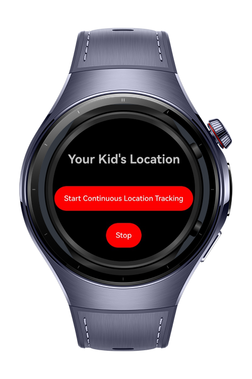

> **Note:** To access all shared projects, get information about environment setup, and view other guides, please visit [Explore-In-HMOS-Wearable Index](https://github.com/Explore-In-HMOS-Wearable/hmos-index).

# How to track location

This app allows parents to watch their kid's location changes. It gives vibration when change is bigger than 400 meter and works continuously even screen is locked.

# Preview
<div>

</div>

# Use Cases
- Users can share their location and take vibration notification if the change is bigger than 400 meter. Parents can use this app to follow their kid.

# Technology
## Stack

- **Languages**: ArkTS, ArkUI
- **Frameworks**: HarmonyOS SDK 5.0.2(14)
- **Tools**: DevEco Studio Vers 5.1.0.820
- **Libraries**: @kit.ArkUI, @kit.LocationKit, @kit.BackgroundTasksKit, @kit.AbilityKit, @kit.BasicServicesKit, @ohos.vibrator, @kit.MapKit

## Required Permissions
- ohos.permission.LOCATION
- ohos.permission.KEEP_BACKGROUND_RUNNING
- ohos.permission.APPROXIMATELY_LOCATION
- ohos.permission.INTERNET
- ohos.permission.VIBRATE

# Directory Structure
```
entry/src/main/ets/
|---pages
|   |---Index.ets                
|---Utils      
|   |---PermissionUtils.ets                                               
|---entryability                   
|---entrybackupability 
   
```

# Constraints and Restrictions
## Supported Device
- Huawei Watch 5

# LICENSE
**Follow your kid** is distributed under the terms of the MIT License.
See the [license](/LICENSE) for more information.